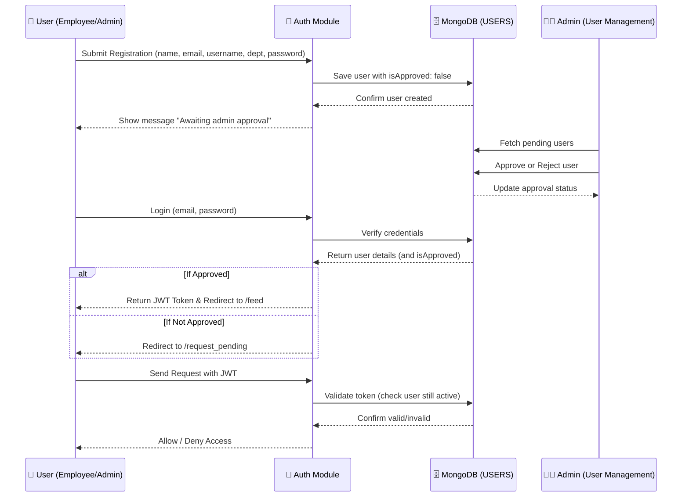

## Authentication & Authorization — Level 2 Sequence Diagram

```mermaid
sequenceDiagram
    participant U as 👤 User (Employee/Admin)
    participant A as 🧩 Auth Module
    participant DB as 🗄️ MongoDB (USERS)
    participant ADM as 🧑‍💻 Admin (User Management)

    %% ==== REGISTRATION FLOW ==== %%
    U->>A: Submit Registration (name, email, username, dept, password)
    A->>DB: Save user with isApproved: false
    DB-->>A: Confirm user created
    A-->>U: Show message "Awaiting admin approval"

    %% ==== ADMIN APPROVAL ==== %%
    ADM->>DB: Fetch pending users
    ADM->>DB: Approve or Reject user
    DB-->>ADM: Update approval status

    %% ==== LOGIN FLOW ==== %%
    U->>A: Login (email, password)
    A->>DB: Verify credentials
    DB-->>A: Return user details (and isApproved)
    alt If Approved
        A-->>U: Return JWT Token & Redirect to /feed
    else If Not Approved
        A-->>U: Redirect to /request_pending
    end

    %% ==== TOKEN VALIDATION ==== %%
    U->>A: Send Request with JWT
    A->>DB: Validate token (check user still active)
    DB-->>A: Confirm valid/invalid
    A-->>U: Allow / Deny Access
```
