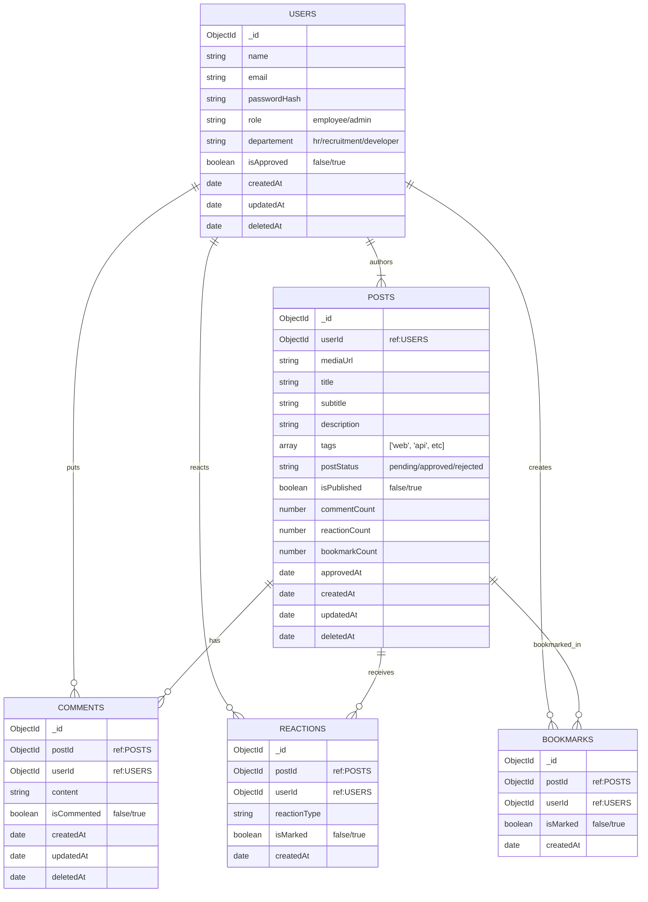

# **Database Schema**

## Overview

The database for the platform is designed using a modular approach, primarily centered around users, posts, and their interactions. Each user can create posts, react, comment, and bookmark them. Posts are moderated and managed by admins.

Soft deletion is implemented for reversible actions and moderation flexibility.  
This design ensures scalability, maintainability, and clear ownership across entities.

## Schema

## **Table Description**

### Table: `USERS`

| Field          | Type     | Description                                                 |
| -------------- | -------- | ----------------------------------------------------------- |
| `_id`          | ObjectId | Unique ID created after registration                        |
| `name `        | string   | Name of the user                                            |
| `email `       | string   | Email ID for unique identification (no duplicates)          |
| `passwordHash` | string   | Hashed password string                                      |
| `role`         | string   | Role of user (`admin` / `employee`)                         |
| `department `  | string   | Department of the user (`hr` / `recruitment` / `developer`) |
| `isApproved`   | boolean  | `false` by default; becomes `true` once approved by admin   |
| `createdAt `   | date     | Timestamp of creation                                       |
| `updatedAt `   | date     | Timestamp of last update                                    |
| `deletedAt`    | date     | Timestamp of soft deletion                                  |

### Table: `POSTS`

| Field           | Type     | Description                                                            |
| --------------- | -------- | ---------------------------------------------------------------------- |
| `_id `          | ObjectId | Auto-generated post ID                                                 |
| `userId`        | ObjectId | Reference to USERS                                                     |
| `mediaUrl  `    | string   | Cloud storage link of uploaded media                                   |
| `title  `       | string   | Title of the post                                                      |
| `subtitle`      | string   | Subtitle of the post                                                   |
| `description`   | string   | Detailed content of the post                                           |
| `tags`          | array    | List of tags for categorization (e.g., ['web', 'api', 'ui'])           |
| `postStatus`    | string   | `pending` by default; updated to `approved` or `rejected` by admin     |
| `isPublished`   | boolean  | `true` after approval; toggle to `false` hides from feed (soft delete) |
| `commentCount`  | number   | Total number of comments                                               |
| `reactionCount` | number   | Total number of reactions                                              |
| `bookmarkCount` | number   | Total number of bookmarks                                              |
| `approvedAt`    | date     | Timestamp when post was approved                                       |
| `createdAt`     | date     | Timestamp of creation                                                  |
| `updatedAt`     | date     | Timestamp of last update                                               |
| `deletedAt`     | date     | Timestamp of soft deletion                                             |

### Table: `COMMENTS`

| Field         | Type     | Description                                         |
| ------------- | -------- | --------------------------------------------------- |
| `_id  `       | ObjectId | Generated when comment is added                     |
| `postId `     | ObjectId | Reference to POSTS                                  |
| `userId  `    | ObjectId | Reference to USERS                                  |
| `content `    | string   | Text content of the comment                         |
| `isCommented` | boolean  | `true` by default; set to `false` when soft-deleted |
| `createdAt`   | date     | Timestamp of creation                               |
| `updatedAt`   | date     | Timestamp of last update                            |
| `deletedAt`   | date     | Timestamp of soft deletion                          |

### Table: `REACTIONS`

| Field       | Type     | Description                                       |
| ----------- | -------- | ------------------------------------------------- |
| `_id `      | ObjectId | Generated when a post is bookmarked               |
| `postId `   | ObjectId | Reference to POSTS                                |
| `userId`    | ObjectId | Reference to USERS                                |
| `isMarked ` | boolean  | `true` by default; set to `false` if unbookmarked |
| `createdAt` | date     | Timestamp of bookmark creation                    |

### Table: `BOOKMARKS`

| Field          | Type     | Description                                    |
| -------------- | -------- | ---------------------------------------------- |
| `_id `         | ObjectId | Generated when a user reacts to a post         |
| `postId `      | ObjectId | Reference to POSTS                             |
| `userId`       | ObjectId | Reference to USERS                             |
| `reactionType` | string   | Type of reaction (emoji, like, etc.)           |
| `isMarked `    | boolean  | `true` by default; set to `false` if unreacted |
| `createdAt`    | date     | Timestamp of reaction creation                 |
