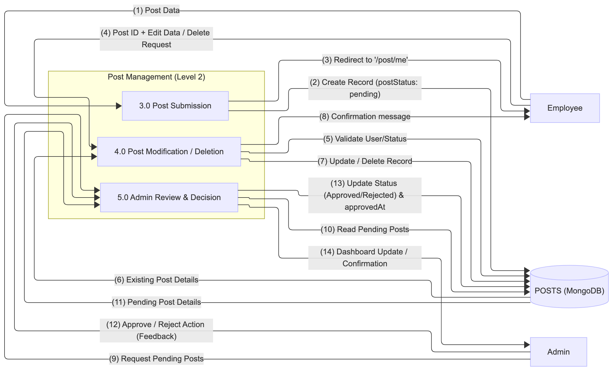

# **DFD Level 2: Post Management**

---

## Overview

The **Post Management** module handles the entire content lifecycle — from an employee’s initial submission to the final administrative decision. This module ensures that all content adheres to quality standards before being published to the main system feed.  
It manages the **creation**, **modification**, **deletion**, and **approval** of all posts.

The module primarily interacts with the **POSTS (Table)** collection to maintain post records and status tracking throughout their lifecycle.

---

## Workflow Explanation

The module is divided into three core processes:

1. **Post Submission**
2. **Post Modification / Deletion**
3. **Admin Review & Decision**

Each process focuses on a specific aspect of the post lifecycle while maintaining secure interactions with the database.

---

## Workflow of Auth & Auth Module

{ width="2900" height="2600" }

---

## Post Submission (P1)

This flow describes how an **Employee** submits new content:

1. **Employee → 3.0 Post Submission (1) Post Data**  
   The Employee sends post content — `Title`, `Description`, `Media URL`, and `Tags` — to the **3.0 Post Submission** process.

2. **3.0 Post Submission → POSTS (2) Create Record**  
   The process creates a new document in the **POSTS** collection, automatically setting the `postStatus` to `"pending"`.

3. **3.0 Post Submission → Employee (3) Redirect**  
   The Employee is redirected to the **`/post/me`** page with a success message, where they can view their new post in a **pending** state.

---

## Post Modification / Deletion (P2)

This flow allows an **Employee** to manage their existing posts:

1. **Employee → 4.0 Post Modification / Deletion (4) Post ID + Request**  
   The Employee sends a request to **edit** or **delete** one of their posts.

2. **4.0 Post Modification / Deletion → POSTS (5) Validate User/Status**  
   The process queries the database to ensure the requester is the original author (`userId` match) + JWT validation and checks the current post status.

3. **POSTS → 4.0 Post Modification / Deletion (6) Existing Post Details**  
   The database returns the required post details for validation of author.

4. **4.0 Post Modification / Deletion → POSTS (7) Update / Delete Record**  
   If validation succeeds, the process either updates the post content or marks it as deleted by setting the `deletedAt` field (soft deletion).

5. **4.0 Post Modification / Deletion → Employee (8) Confirmation**  
   The Employee receives confirmation that the update or deletion was successful.

---

## Admin Review & Decision (P3)

This flow is managed by the **Admin**, who oversees content approval and publication:

1. **Admin → 5.0 Admin Review & Decision (9) Request Pending Posts**  
   The Admin requests a list of posts awaiting review through the Admin dashboard.

2. **5.0 Admin Review & Decision → POSTS (10) Read Pending Posts**  
   The process queries the **POSTS** collection for records where `postStatus: "pending"`.

3. **POSTS → 5.0 Admin Review & Decision (11) Pending Post Details**  
   The database returns the pending posts to the Admin for review.

4. **Admin → 5.0 Admin Review & Decision (12) Approve / Reject Action**  
   The Admin chooses to **Approve** or **Reject** the post, optionally providing feedback.

5. **5.0 Admin Review & Decision → POSTS (13) Update Status**  
   The process updates the record in the **POSTS** collection, changing `postStatus` to `"approved"` or `"rejected"`, and sets the `approvedAt` timestamp.

6. **5.0 Admin Review & Decision → Admin (14) Dashboard Update**  
   The Admin dashboard confirms the successful status change and refreshes the view.

---

## Process Summary

| Process                              | Action                             | Outcome                                     |
| ------------------------------------ | ---------------------------------- | ------------------------------------------- |
| **3.0 Post Submission**              | Employee submits content           | New post created with `postStatus: pending` |
| **4.0 Post Modification / Deletion** | Employee edits or deletes post     | Post updated or marked as deleted           |
| **5.0 Admin Review & Decision**      | Admin reviews and approves/rejects | Post published or rejected                  |

---

## Summary

- The **Post Management** module acts as the **content quality gatekeeper** for the GKMIT_INSIDE platform.
- It enforces a structured flow where Employees focus on content creation, while Admins maintain governance and moderation.
- Through approval workflows, it ensures that only reviewed and authorized posts reach the main feed.
- This separation of duties maintains platform integrity, promotes accountability, and supports transparent publication control.
- Ultimately, it forms a vital bridge between **content creation** and **content governance** within the system.

---
